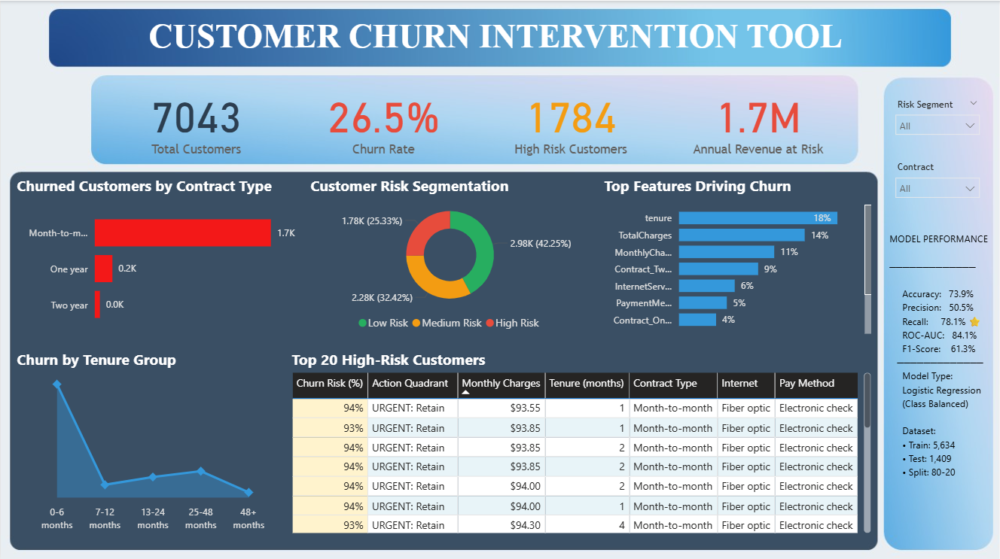

# 📊 Customer Churn Prediction & Intervention Tool

<div align="center">

**An end-to-end machine learning project to predict customer churn and enable proactive retention strategies**

[View Dashboard](#-dashboard) • [Key Findings](#-key-findings) • [Methodology](#-methodology) • [Business Recommendations](#-business-recommendations)

</div>

---

## 🎯 Project Overview

This project builds a **customer churn prediction model** and **interactive dashboard** to help telecom companies identify at-risk customers and prioritize retention efforts. By analyzing 7,043 customer records, the model achieves **78% recall** in identifying churners and quantifies **$1.7M in annual revenue at risk**.

### Business Problem

Telecom companies face significant revenue loss from customer churn. Acquiring new customers costs 5x more than retaining existing ones. This project answers:

- **Who** is likely to churn?
- **When** do customers typically leave?
- **Why** are they churning?
- **What** actions should the retention team take?

---

## 📈 Key Findings

### Critical Insights

| Finding | Impact | Action |
|---------|--------|--------|
| 🔴 **42% of churn happens in first 6 months** | High customer acquisition cost wasted | Implement enhanced onboarding program |
| 🔴 **Month-to-month contracts: 88% of churners** | 1,655 customers lost (42.7% churn rate) | Incentivize annual contract upgrades |
| 🔴 **1,784 high-risk customers identified** | $1.7M annual revenue at risk | Proactive retention calls this week |
| 🟡 **Fiber optic customers churn 2x more** | Service quality issue indicator | Investigate fiber service issues |

### Model Performance
```
✅ Recall:      78.1% ⭐ (Catches 78% of churners - optimized metric)
✅ ROC-AUC:     84.1%    (Excellent discrimination)
✅ Accuracy:    73.9%    (Overall correctness)
✅ Precision:   50.5%    (Trade-off for higher recall)
✅ F1-Score:    61.3%    (Balanced performance)

Model: Logistic Regression (Class Balanced)
Dataset: 7,043 customers | 80-20 stratified split
```

**Why Recall matters most for churn:**
- Missing a churner costs **$1,500** (lost annual revenue)
- False alarm costs only **$5** (unnecessary retention call)
- Model optimized to catch churners, even with more false alarms

---

## 📊 Dashboard

### Customer Churn Intervention Tool



**Interactive Features:**
- 🔍 Filter by Risk Level, Contract Type, Internet Service
- 📋 Top 20 high-risk customers for immediate action
- 📈 Real-time churn probability scoring
- 💰 Revenue impact quantification

### What Each Visual Answers

| Visual | Business Question | Key Insight |
|--------|------------------|-------------|
| **KPI Cards** | How big is the problem? | 26.5% churn rate, $1.7M at risk |
| **Churned by Contract** | Which contract type loses most customers? | Month-to-month: 1,655 churned (88%) |
| **Risk Segmentation** | How many need immediate attention? | 1,784 high-risk customers |
| **Feature Importance** | What drives churn? | Tenure (18%), Charges (14%), Contract (9%) |
| **Churn by Tenure** | When do customers leave? | 784 churn in 0-6 months (42% of all churn) |
| **Top 20 Table** | Who to call TODAY? | Customers with 94%+ churn probability |

---

## 💰 Revenue Opportunity Analysis

### Intervention Scenarios

**Scenario 1: Reduce Month-to-Month Churn by 10%**
- Target: 1,655 month-to-month churners
- Retention: 166 customers (10%)
- **Annual Savings: $159,360**

**Scenario 2: Improve First 6-Month Retention by 15%**
- Target: 784 new customers (0-6 months)
- Retention: 118 customers (15%)
- **Annual Savings: $113,280**

**Scenario 3: High-Risk + High-Value Customers**
- Target: 450 customers (>$80/month, >70% churn probability)
- Retention: 90 customers (20%)
- **Annual Savings: $103,680**

**💡 Total Projected Savings: $376,320+ annually**

---

## 🛠️ Methodology

### 1. Data Exploration & Cleaning
- Dataset: 7,043 customers, 21 features
- Handled missing values in `TotalCharges` (11 records)
- Encoded categorical variables (one-hot encoding)
- Created risk segmentation (Low/Medium/High)

### 2. Feature Engineering
```python
# Created customer tenure groups
Tenure Groups: 0-6, 7-12, 13-24, 25-48, 48+ months

# Risk segmentation based on churn probability
High Risk:   >70% probability (1,784 customers)
Medium Risk: 30-70% probability (2,280 customers)
Low Risk:    <30% probability (2,979 customers)
```

### 3. Model Development
- **Algorithm:** Logistic Regression with class balancing
- **Train-Test Split:** 80-20, stratified by churn
- **Feature Scaling:** StandardScaler
- **Optimization:** Prioritized recall over precision

**Why Logistic Regression?**
- Interpretable coefficients (business stakeholders understand it)
- Fast training and inference
- Probability outputs for risk scoring
- Outperformed Random Forest on recall (78% vs 73%)

### 4. Model Comparison

| Model | Accuracy | Precision | Recall | ROC-AUC |
|-------|----------|-----------|--------|---------|
| **Logistic Regression (Balanced)** | 73.9% | 50.5% | **78.1%** ⭐ | 84.1% |
| Random Forest (Balanced) | 76.7% | 54.5% | 73.3% | 84.2% |

**Selected: Logistic Regression** - Higher recall for catching more churners

---

## 🔍 Feature Importance

**Top Churn Drivers:**

1. **Tenure** (18%) - New customers churn most
2. **Total Charges** (14%) - High lifetime value customers at risk
3. **Monthly Charges** (11%) - Pricing sensitivity
4. **Contract Type - Two Year** (9%) - Long-term commitment reduces churn
5. **Internet Service - Fiber Optic** (6%) - Service quality issue

---

## 📂 Project Structure
```
customer-churn-prediction/
├── README.md                          # Project documentation
├── requirements.txt                   # Python dependencies
├── .gitignore                        # Git ignore file
│
├── data/
│   └── Telco-Customer-Churn.csv      # Dataset (7,043 customers)
│
├── notebooks/
│   └── churn_analysis.ipynb          # Complete analysis workflow
│
├── outputs/
│   ├── churn_predictions.csv         # Model predictions
│   ├── feature_importance.csv        # Feature rankings
│   ├── confusion_matrix.png          # Model evaluation
│   ├── roc_curve.png                # ROC-AUC visualization
│   └── feature_importance.png        # Top features chart
│
└── dashboard/
    ├── Churn_Dashboard_Final.png     # Dashboard screenshot
    └── Churn_Dashboard_Final.pdf     # Full dashboard (downloadable)
```

---

## 📊 Data Source

**Dataset:** Telco Customer Churn  
**Source:** [Kaggle - Telco Customer Churn](https://www.kaggle.com/blastchar/telco-customer-churn)  
**Records:** 7,043 customers  
**Features:** 21 (demographics, services, account info)  
**Target:** Churn (Yes/No)

---

## 💡 Business Recommendations

### Immediate Actions (Week 1)

1. **🔴 Call High-Risk Customers**
   - Target: Top 100 customers (>90% churn probability)
   - Action: Retention offers, service issue resolution
   - Expected: 25% retention = $230K saved

2. **🟠 Month-to-Month Contract Upgrades**
   - Target: Month-to-month customers
   - Action: 10% discount for annual upgrade
   - Expected: 15% conversion = $239K saved

### Strategic Initiatives (Month 1-3)

3. **📞 Enhanced Onboarding Program**
   - Target: Customers 0-6 months tenure
   - Action: 3-month and 6-month check-in calls
   - Expected: 15% churn reduction = $113K saved

4. **🔧 Fiber Optic Service Investigation**
   - Target: Fiber customers (higher churn than DSL)
   - Action: Quality audit and improvement plan
   - Expected: Service quality improvement

5. **💳 Auto-Pay Incentives**
   - Target: Electronic check customers (45% churn)
   - Action: $5/month discount for auto-pay enrollment
   - Expected: Payment friction reduction

---

## 🎓 Skills Demonstrated

**Technical:**
- Machine Learning (Logistic Regression, Random Forest)
- Feature Engineering & Selection
- Model Evaluation & Optimization
- Data Visualization (Matplotlib, Seaborn)
- Business Intelligence (Power BI)
- Python (Pandas, NumPy, Scikit-learn)

**Business:**
- Problem Framing & ROI Analysis
- Customer Segmentation
- Risk Scoring & Prioritization
- Dashboard Design for Stakeholders
- Actionable Insight Generation

---

## 📝 Key Learnings

1. **Class imbalance matters:** Using `class_weight='balanced'` increased recall from 57% to 78%
2. **Recall > Accuracy for churn:** Missing a churner is 300x more expensive than a false alarm
3. **Early churn signals:** 42% churn in first 6 months → onboarding is critical
4. **Contract commitment works:** Two-year contracts have 15x lower churn than month-to-month
5. **Actionable insights > Complex models:** Logistic Regression outperformed Random Forest for business use

---

## 🔮 Future Enhancements

- [ ] Add time-series analysis for churn trend forecasting
- [ ] Implement customer lifetime value (CLV) scoring
- [ ] Build A/B testing framework for retention strategies
- [ ] Deploy model as REST API for real-time scoring
- [ ] Add sentiment analysis from customer support interactions
- [ ] Create automated weekly reports for retention team

---

<div align="center">

**⭐ Star this repository if you found it helpful!**

**Built with Python • Scikit-learn • Power BI**

</div>
